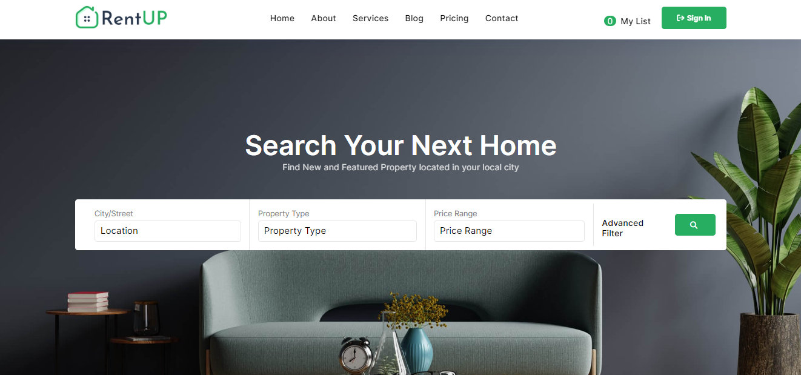

# Real Estate Website

## Description

A Real Estate website that allows users to search for properties, view property details, and connect with real estate agents. It provides a user-friendly platform for both property buyers and sellers to interact and find their ideal real estate deals.

## Features

- **Property Listings:** Display a wide range of property listings with detailed information, including price, location, size, and more.
- **Search and Filters:** Enable users to search for properties based on location, price range, property type, and other criteria.
- **Property Details:** Provide in-depth property information, including images, descriptions, and contact details of real estate agents.
- **Contact Agents:** Allow users to get in touch with real estate agents for inquiries or property visits.
- **User Authentication:** Implement user accounts for saving favorite properties and managing property listings (for property owners/agents).
- **Responsive Design:** Ensure that the website is accessible on various devices and screen sizes.

## Technologies Used
  - HTML, CSS, JavaScript
  - React JS

## Demo

You can access the live demo [here](https://rent-up22.vercel.app).

